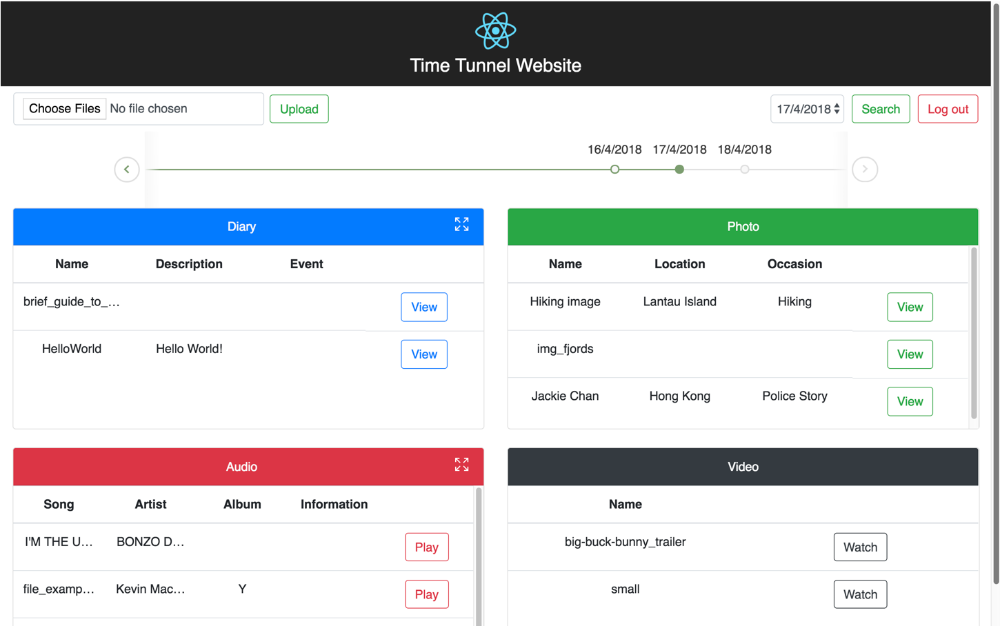
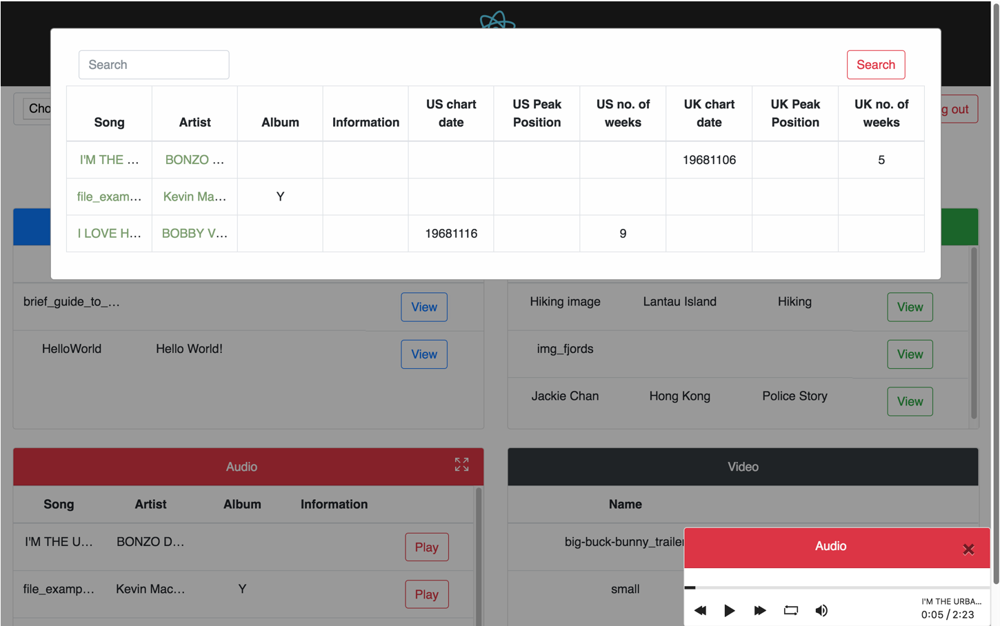
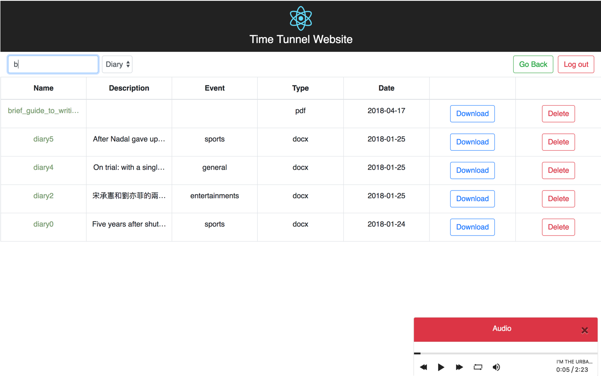
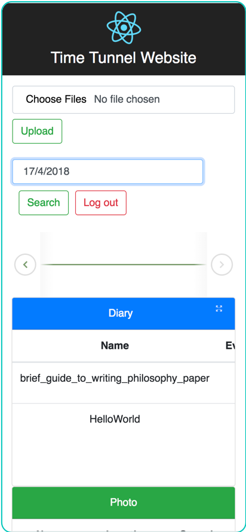

# Time Tunnel eDiary

An e-diary web-application that provides a simple but intuitive UI to review your memories. 

Features include:
* Horizontal timeline for scrolling through dates
* Quick view and expandable containers
* Audio/Video player
* Photo viewer
* Text/pdf viewer
* Table sorting, searching, and filtering
* Responsive mobile view
* Support for legacy filetypes along with metadata extraction e.g. wtv 

[Screenshots](https://angel.co/projects/770883-time-tunnel-website)

[Hosted application](http://time-tunnel.herokuapp.com/)    

## Getting Started

These instructions will get you a copy of the project up and running on your local machine for development and testing purposes. 

See deployment for notes on how to deploy the project on a live system.

### Prerequisites

* [NodeJS](https://nodejs.org/en/)
* [MongoDB](https://www.mongodb.com/download-center/enterprise)

### Installing

Install required dependencies by running:

`npm install && cd client && npm install && cd ..`

Then run: `npm run start` to start the application

## Running the tests

This repo uses mocha for testing.

To run the tests do `npm run test`

## Deployment

Add additional notes about how to deploy this on a live system

## Built With

* [ReactJS](https://reactjs.org/) - The frontend library used
* [NodeJS](https://nodejs.org/en/) - Server
* [ExpressJS](https://expressjs.com/) - Lightweight NodeJS framework for easy creation of basic RESTful API endpoints
* [MongoDB](https://www.mongodb.com/) - No-SQL database
* [Mongoose](https://mongoosejs.com/) - ODM for MongoDB

## Acknowledgments

Special thanks to [CodyHouse](https://codyhouse.co/) for the [horizontal timeline](https://codyhouse.co/gem/horizontal-timeline)  

## Additional Screenshots

